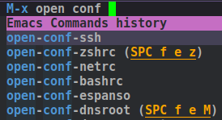

<p align="left"><a href="http://www.gnu.org/licenses/gpl-3.0.txt"></a>


# `open-conf`

open-conf` an Emacs package, allows you to open files quickly via **M-x command** with given alias.


# How it works




## Installation

### MELPA

  It will be in the Melpa in next days.

### Manual

  Put `open-conf.el` in your load-path, and eval `(require 'open-conf')`.

  Also you have to define your shortcuts via `defun-open-conf` function

  ```elisp
  (defun-open-conf  "bashrc"          "~/.bashrc")
  (defun-open-conf  "etc-hosts-root"  "/sudo:root@localhost:/etc/hosts") ;; Open file with root
  ```

### use-package

   Easy try with `use-package`

``` elisp
   (use-package open-conf
     :ensure t
     :config
     (progn
     (defun-open-conf  "bashrc"          "~/.bashrc")
     (defun-open-conf  "etc-hosts-root"  "/sudo:root@localhost:/etc/hosts"))) ;; Open file with root
```


### straight.el

```elisp
(use-package open-conf
:straight '(open-conf
:type git
:host github
:repo "enisozgen/open-conf")
:config
(defun-open-conf  "bashrc"          "~/.bashrc")
(defun-open-conf  "etc-hosts-root"  "/sudo:root@localhost:/etc/hosts")) ;; Open file with root
```
